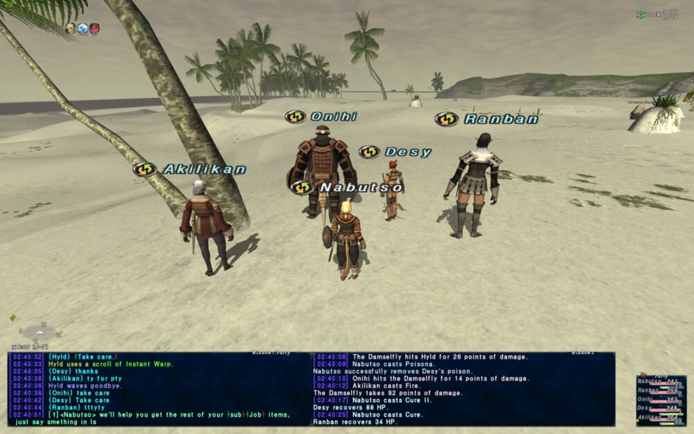
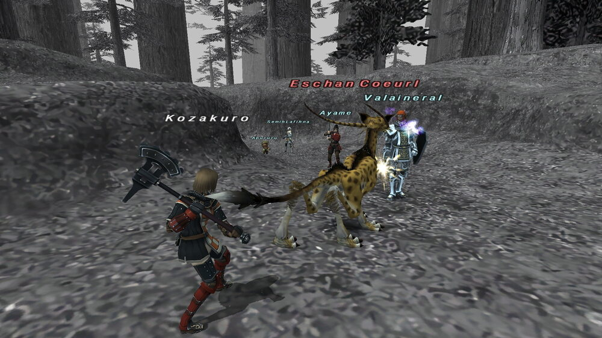

# Vana'diel Reverie

A Final Fantasy XI–style browser MMORPG built with Three.js. Single-player with AI party
companions: jobs (WAR/MNK/WHM/BLM/THF), auto-attack combat, weapon skills, spells, quests,
crafting, gathering, vendors, a day/night cycle, and a field boss.

**🎮 Play now: [ffxi-browser.vercel.app](https://ffxi-browser.vercel.app)** — no install, just
open it in a WebGL2 browser.

New to the game? Check the **[How To Play guide](HOWTO.md)** for jobs, controls, quests, and
crafting recipes.

All 3D assets are free CC0 packs (Quaternius Universal Base Characters / Modular Fantasy
Outfits / Universal Animation Library / animated monsters, KayKit environment kits).




---

## Requirements

- **Node.js 18+** (20+ recommended) — https://nodejs.org
- npm (ships with Node)
- A modern browser with WebGL2 (Chrome, Firefox, Edge, Safari)

## 1. Install dependencies

```bash
cd ffxi-browser
npm install
```

## 2. Run the development server (for local play / hacking on the code)

```bash
npm run dev
```

Vite prints a local URL (default `http://localhost:5173`). Open it in your browser.
Changes to files in `src/` hot-reload automatically.

To allow other devices on your LAN to connect:

```bash
npx vite --host          # then open http://<your-LAN-IP>:5173 from another machine
```

## 3. Production build

```bash
npm run build
```

This outputs a fully static site into `dist/` (~31 MB, mostly 3D models). There is no
backend — any static file server can host it.

Preview the production build locally:

```bash
npm run preview          # serves dist/ at http://localhost:4173
```

## 4. Hosting `dist/` on a server

The game is 100% static files. Pick any one of these:

**Quick one-liners (from the project root, after `npm run build`):**

```bash
# Node
npx serve dist

# Python 3
cd dist && python3 -m http.server 8080
```

**nginx** — point a server block at the `dist` folder:

```nginx
server {
    listen 80;
    server_name your-domain.example;
    root /var/www/ffxi-browser/dist;
    index index.html;

    # long-cache the heavy model/texture assets
    location ~* \.(glb|gltf|bin|png|jpg)$ {
        expires 30d;
        add_header Cache-Control "public, immutable";
    }
}
```

Copy the build up and reload:

```bash
rsync -av dist/ user@server:/var/www/ffxi-browser/dist/
sudo nginx -s reload
```

**Apache** — copy `dist/` into your DocumentRoot; no special config needed
(everything is plain GET requests, no rewrites required).

**Vercel** (zero-config):

```bash
npm i -g vercel
vercel --prod            # framework: Vite is auto-detected, output dir: dist
```

**Netlify / GitHub Pages / Cloudflare Pages**: set build command `npm run build`,
publish directory `dist`.

> Tip: enable gzip/brotli on your server — the `.gltf`/`.bin` files compress well.

## 5. Playing

| Input | Action |
|---|---|
| Left-click ground | Move to location |
| Hold L+R mouse / WASD | Run |
| Right-drag | Orbit camera, mouse wheel zooms |
| Tab / click | Target enemies and NPCs |
| 1–0 | Hotbar abilities, spells, weapon skills, items |
| Right-click target | Context menu (attack, talk, shop…) |
| F | First-person toggle |
| Enter | Chat · `?` opens help |

Progress saves automatically to the browser's localStorage (per browser/device).

## Project layout

```
index.html        UI markup + FFXI-style CSS
src/
  main.js         Bootstrap, renderer, loop
  world.js        Terrain, town, ruins, beach, sky, day/night
  entities.js     Character/monster model assembly + animation
  game.js         Combat, AI, quests, items, save/load
  ui.js           HUD, dialogs, logs, minimap
  controls.js     Mouse/keyboard + camera
  data.js         Jobs, actions, items, monsters, quests
public/
  models/chars/   Rigged characters + Universal Animation Library
  models/         Monster GLBs (sheep, bee/wasp, boss dragon)
  models/env/     KayKit nature / town / props / dungeon kits
  textures/       Terrain detail textures
test/             Puppeteer smoke tests and screenshot scripts
```

### Dev verification scripts

With a dev server running on port 4399 (`npx vite --port 4399`):

```bash
node test/smoke.mjs        # boots the game headless, reports console errors + FPS
node test/screenshot.mjs   # saves /tmp/gfx-day.png, gfx-closeup.png, gfx-dusk.png
node test/beachshot.mjs    # saves /tmp/beach.png (coast view)
```
